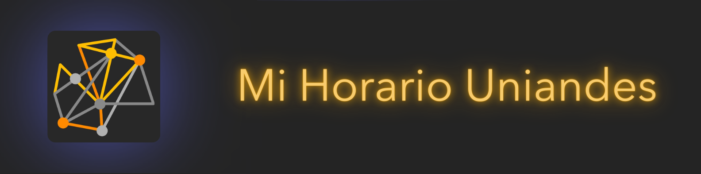

# Mi Horario Uniandes

*Haz clic en la imagen para ver una demostración de la aplicación.*

## ¡Bienvenido a Mi Horario Uniandes!

**Mi Horario Uniandes** es una aplicación web diseñada para ayudarte a crear el horario perfecto utilizando la API de cursos de la Universidad de los Andes. Con una interfaz intuitiva y diversas funcionalidades, puedes organizar tus clases y optimizar tu tiempo de estudio de manera eficiente.

### Funcionalidades Principales
La aplicación ofrece las siguientes herramientas para facilitar la creación de tu horario:

1. **Selección de secciones:** Agrega secciones específicas de cursos que deseas considerar entre tus opciones.
2. **Bloques de tiempo personalizados:** Define bloques de tiempo en los que prefieres no tener clases.
3. **Optimización de horarios:** Optimiza tus horarios según una métrica personalizada, adaptada a tus necesidades.
4. **Consulta de CBU's:** Encuentra todos los CBU's que se ajusten a un horario específico.
5. **Consulta de cursos especiales:** Filtra y consulta cursos especiales (Tipo E, Epsilon, etc.) que encajen dentro de un horario determinado.

### Acceso a la Aplicación
Visita la aplicación web desplegada [aquí](https://open-source-uniandes.github.io/Mi-Horario-Uniandes/)

## Reporte de Errores y Sugerencias

Si encuentras un error, por favor añádelo como un [issue](https://github.com/Open-Source-Uniandes/Mi-Horario-Uniandes/issues).

## Colaboración

¿Tienes una idea increíble que quisieras implementar? Te invitamos a abrir un nuevo [pull request](https://github.com/Open-Source-Uniandes/Mi-Horario-Uniandes/pulls) con tus cambios propuestos.

El software lo construimos entre todos 💛

## Colaboradores

- [Wilmer Arévalo](https://github.com/wareval0) - w.arevalo@uniandes.edu.co  
- [Alejandro Pulido](https://github.com/alejandroPulido03)
- [Juan Espitia](https://github.com/jmpizza)

## Contacto

Para cualquier consulta o sugerencia, puedes contactarnos al correo [d.diazm@uniandes.edu.co](mailto:d.diazm@uniandes.edu.co)

Descubre más sobre el proyecto Open Source Uniandes [aquí](https://github.com/Open-Source-Uniandes) 👈
